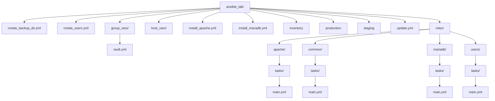

```mermaid
graph TD
  A[ansible_lab/] --> B[create_backup_dir.yml]
  A --> C[create_users.yml]
  A --> D[group_vars/]
  D --> D1[vault.yml]
  A --> E[host_vars/]
  A --> F[install_apache.yml]
  A --> G[install_mariadb.yml]
  A --> H[inventory]
  A --> I[production]
  A --> J[staging]
  A --> K[update.yml]
  A --> L[roles/]
  
  L --> L1[apache/]
  L1 --> L1a[tasks/]
  L1a --> L1a1[main.yml]

  L --> L2[common/]
  L2 --> L2a[tasks/]
  L2a --> L2a1[main.yml]

  L --> L3[mariadb/]
  L3 --> L3a[tasks/]
  L3a --> L3a1[main.yml]

  L --> L4[users/]
  L4 --> L4a[tasks/]
  L4a --> L4a1[main.yml]
```

